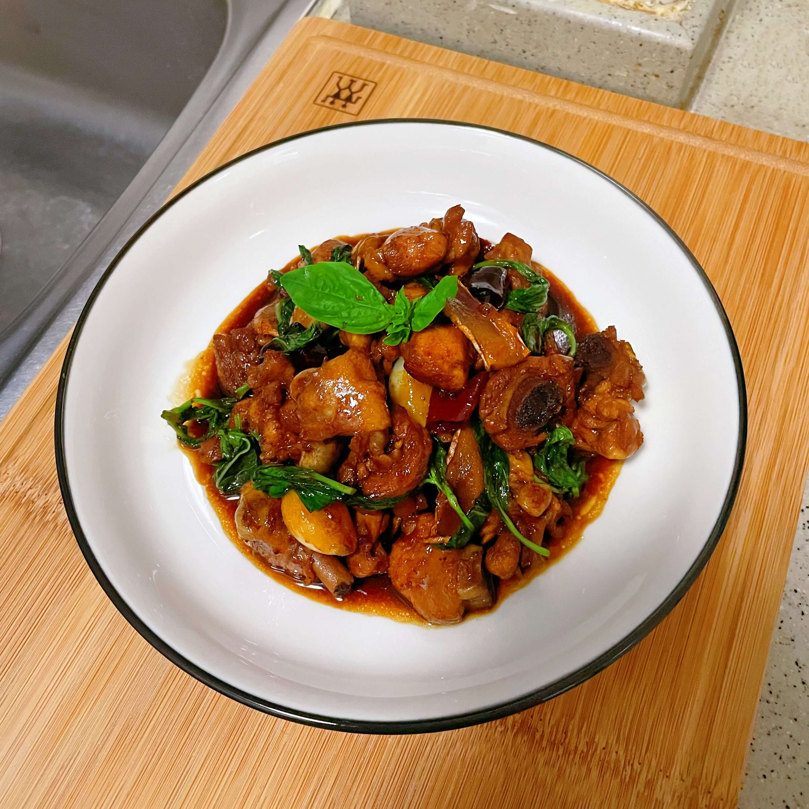

## 食材

- 新鲜鸡腿  4个
- 新鲜罗勒叶(九层塔)  1小把
- 姜片  6-8片
- 大蒜粒  6-8颗
- 葱白  2根
- 干辣椒  3个
- 红標料理米酒  8勺
- 金兰酱油  3勺
- 老抽  1勺
- 冰糖  5-8颗

## 做法

- 将新鲜鸡腿洗净后剁成小块
- 将鸡腿肉**冷水**下锅，倒入料酒、小葱，煮至鸡腿肉变白后即可捞出洗净待用
- 生姜切片，葱白切段，干辣椒切段后待用
- 调味汁: **8勺米酒、3勺金兰酱油、1勺老抽**
- 起锅，倒入芝麻油或黑麻油，可再加少许食用油，加热后倒入姜片爆香
- 倒入大蒜、葱白端、干辣椒继续翻炒
- 倒入焯过水的鸡腿肉翻炒至金黄
- 倒入冰糖炒至融化，主要为了给鸡腿肉上糖色
- 倒入调味汁，大火烧开后转小火收汁
- 待汤汁收的差不多时，放入罗勒叶，盖上锅盖焖一下即可出锅
- 出锅前再倒入少许芝麻油

## 小贴士

- 老抽可以不放或再少量，主要起到上色作用
- 倒水一定用开水，这样做出来的口感更佳

- 鸡腿肉选择新鲜的口味最佳，可在盒马、美团、叮咚买到
- 新鲜罗勒叶是这道菜的灵魂所在
- 由于调味汁已经是很大一碗，可不用再添加水，煮至收汁即可
- 酱油选择台湾的金兰酱油，也可以用普通的生抽代替
- 老抽主要为了上色，可减少用量
