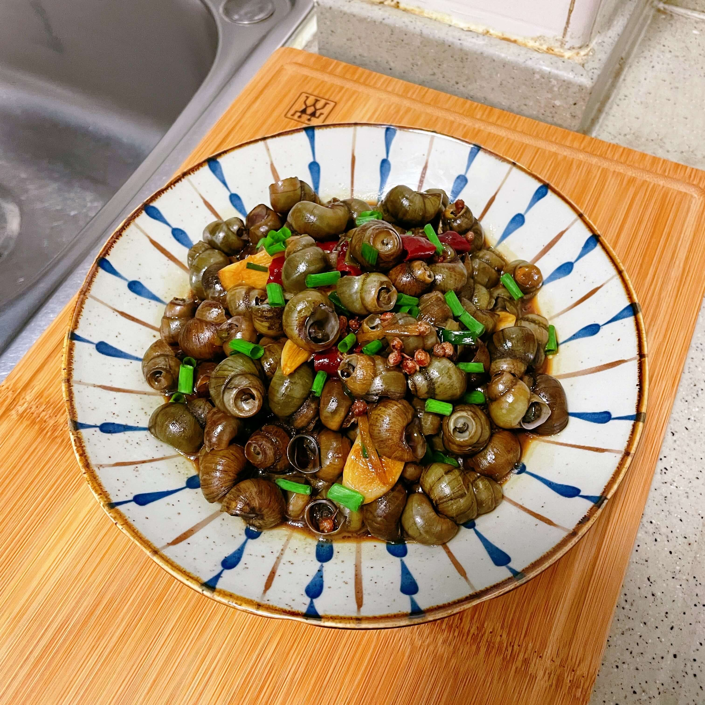

## 食材

- 螺蛳  1斤
- 葱白  2根
- 姜片  2片
- 大蒜  3个
- 干辣椒  3个
- 花椒  1小把
- 料酒  1勺
- 白砂糖  2勺
- 生抽  2勺
- 老抽  1勺
- 郫县豆掰酱  1勺

## 做法

- 将螺蛳洗净后放入盆中，加入凉水，倒入少许食用油，放置1-2小时
- 将螺蛳重新洗净后待用
- 将姜片切丝、大蒜切片、葱白切段、干辣椒切段
- 调味汁： 1勺料酒、2勺白砂糖、2勺生抽、1勺老抽
- 起锅倒入食用油
- 倒入葱、姜、蒜、豆掰酱、干辣椒、花椒翻炒爆香
- 倒入螺蛳翻炒一会后倒入调味汁
- 倒入开水没过螺蛳，盖上锅盖焖煮7-8分钟即可
- 取掉锅盖，倒入葱花后即可出锅

## 小贴士

- 螺蛳很容易炒熟，焖煮7-8分钟口感最佳
- 买回来的螺蛳需洗净后放入装有水的盆中，倒入食用油，主要是为了让螺蛳把小螺蛳吐干净

