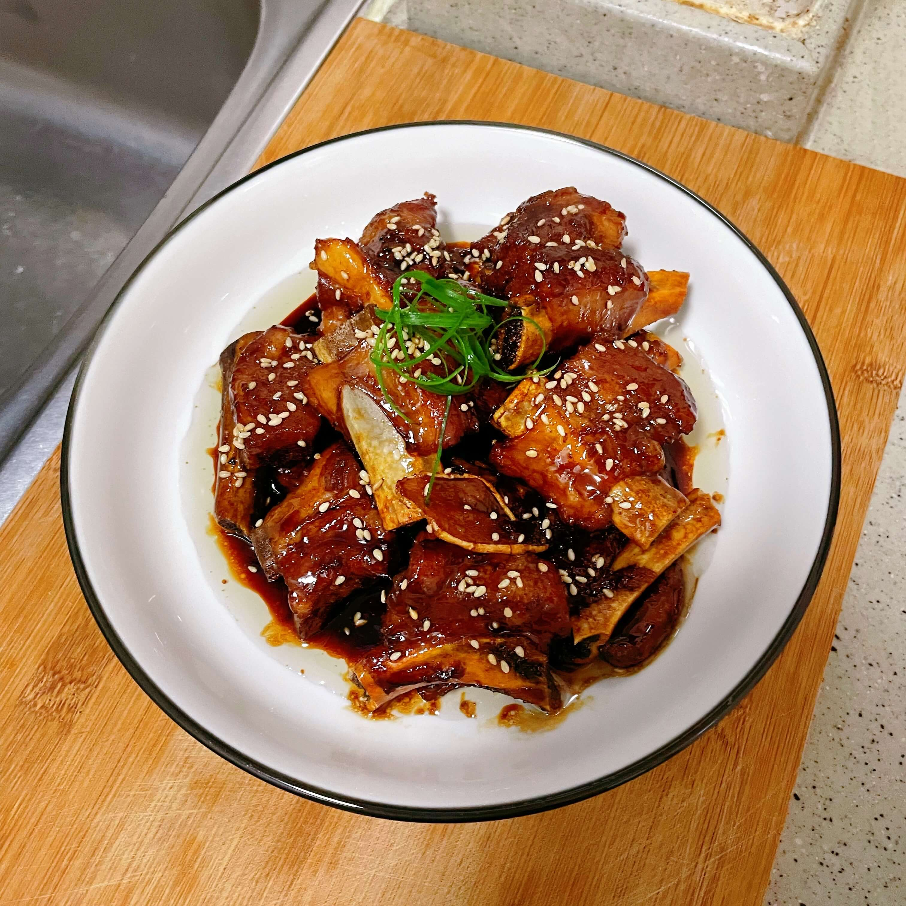

## 食材

- 猪肋排  1斤
- 姜片 3-4片
- 香叶  2片
- 八角  2个
- 料酒  1勺
- 生抽  2勺
- 冰糖  5-8颗
- 香醋  4勺

## 做法

- 将猪肋排洗净后焯水待用
- 调味汁：1勺料酒、2勺生抽、4勺香醋
- 起锅，倒入食用油
- 将焯过水的猪肋排倒入炒至金黄
- 翻炒的同时，加入冰糖，主要为了给排骨上糖色
- 倒入调味汁，倒入**开水**至没过排骨
- 放入姜片、八角、香叶后盖上锅盖，焖煮30分钟左右
- 取掉锅盖，大火收汁后即可出锅

## 小贴士

- 倒入水必须是开水，使肉更佳入味
- 调味汁的口诀：1勺料酒、2勺生抽、3勺糖(5-8颗冰糖)，4勺香醋

