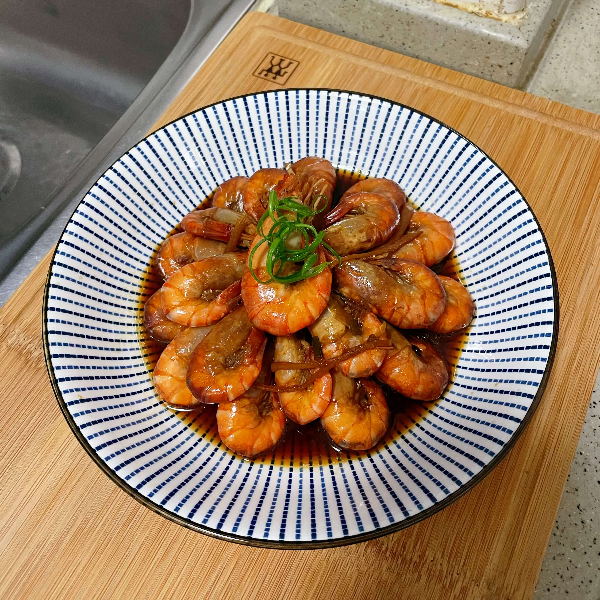

## 食材

- 大头虾(罗氏虾)  1斤
- 姜片  3片
- 葱  1把
- 料酒  1勺
- 生抽  2勺
- 老抽  半勺
- 冰糖  5-8颗

## 做法

- 将大头虾洗净，剪掉虾须和虾脚
- 姜片切丝，葱白切小粒，葱叶切段
- 调味汁比例：1勺料酒、2勺生抽、半勺老抽、冰糖5-8颗
- 起锅倒入食用油，可多一些油
- 倒入姜丝和葱白爆香后，再倒入处理好的大头虾翻炒至变色
- 倒入调味汁，加**开水**与虾齐平，倒入葱叶段
- 盖上锅盖焖煮10-15分钟
- 出锅装盘

## 小贴士

- 老抽可以不放或再少量，主要起到上色作用
- 倒水一定用开水，这样做出来的口感更佳

